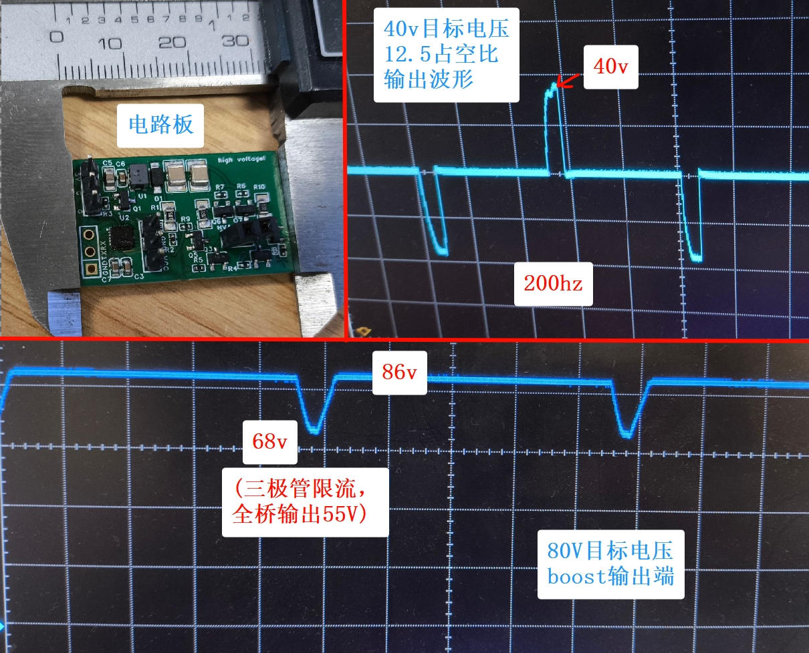

# 功率电路验证

使用ch32v003作为控制器，采用flyback加全桥逆变方案的5V直流转150V交流电路板。
原本是作为冷光线的驱动板使用，但功能与本项目接近。
验证板无安全与保护功能，不应直接用于本项目的用途。

## 目录内容
- epro文件：lceda电路板工程文件，所有元器件参数均可用
- psimsch：psim仿真文件
- firmware：测试用的程序（程序编译使用[ch32funSDK](https://github.com/cnlohr/ch32fun)，如需使用mounriverstudio则需要改动systeminit函数让单片机正确初始化并工作在内部RC电路倍频到48Mhz下。）

## 功能测试

打板电路经过测试，全桥可正常工作，控制器瞬态响应符合预期，升压目标电压可正常调整，软启动可用，测了40v和80v两个目标值。保守参数下测得输出约55v@1.5kΩ（即36mA左右），足以满足大部分使用情况。

电路瞬态响应较差，一方面flyback规模小，最大功率较低，另一方面储能电容也较小的同时三极管全桥限流值较为保守。如需进一步提高瞬时功率可调节boost最大占空比参数，增加HVDC的滤波电容，减小三极管全桥中R10、R11、R8、R9、R4和R5的值以增加限流值，换用更大更难饱和的升压变压器等，但目前的输出电流已经有些令人担忧，所以应在更可控的条件下探索。

## 待完成：
由串口输入指令

