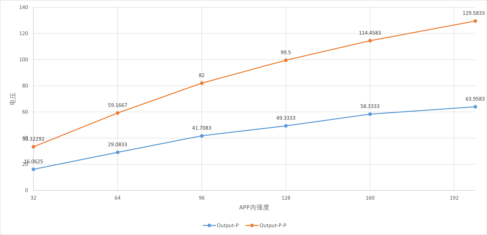
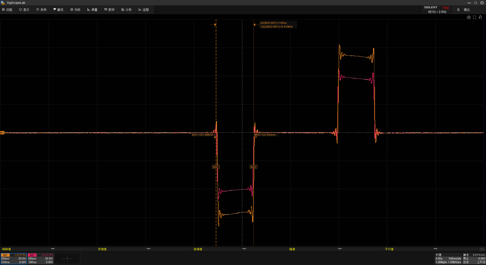
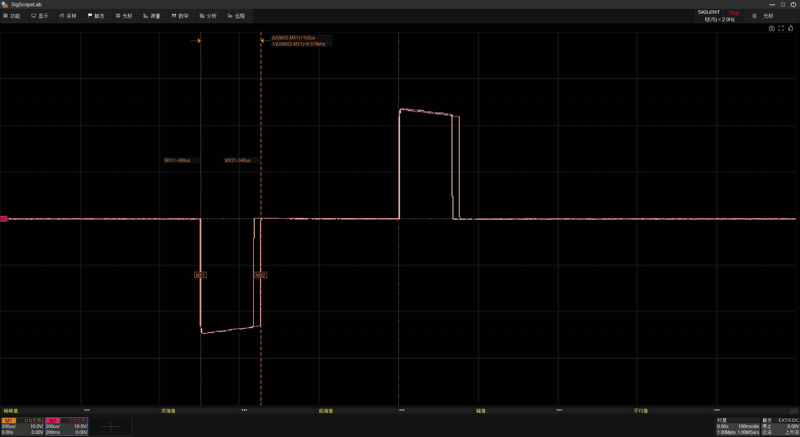

## 测试环境：
```
鼎阳 SDS804X HD + X10探头
APP版本：3.4.7
固件版本：0407(2025/01/10)
输出接入500Ω电阻
```

## APP内强度 - 输出电压关系：


## 部分结论：
1.相同波形改变APP内强度只会改变输出幅值。

2.相同强度下，波形的“强度”只影响占空比。


## 文件内容
共测试了6个波形，`APP内强度 - 输出电压关系` 使用压缩模式的数据绘制。  
保存了示波器截图和 `bin` 文件，可以使用 `FileConverter.zip` 中的工具转换为csv格式进行进一步分析。
